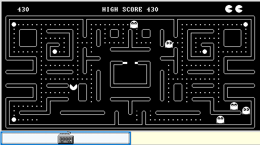

# 🕹️ PAC-MAN RETRO – Nand2Tetris

> 🎮 A classic Pac-Man game built using the Jack language and running on the Nand2Tetris simulator.




## 📌 Description

This is a faithful recreation of the original **Pac-Man** game implemented entirely in **Jack** language as part of the **Nand2Tetris** project. It includes:

- A functional maze with paths and walls.
- Regular and special pellets.
- High score tracking.
- 5 ghosts that chase Pac-Man.
- Win condition (eat all pellets) and loss (lose all 3 lives).
- Pac-Man can eat ghosts after consuming a special pellet.

## 🗂️ Project Structure

The project includes original `.jack` source files and their compiled `.vm` versions.

```
PAC-MAN-DEMO/
├── Game.jack / .vm
├── Ghost.jack / .vm
├── Ghosts.jack / .vm
├── Main.jack / .vm
├── Map.jack / .vm
├── Output.jack / .vm
├── PacMan.jack / .vm
├── Pellet.jack / .vm
├── Random.jack / .vm
├── Score.jack / .vm
├── Wall.jack / .vm
```

## 🛠️ How to Run

1. Download the Nand2Tetris software from the [official site](https://www.nand2tetris.org/software).
2. Open your terminal (e.g. in VS Code) and navigate to the `PAC-MAN-DEMO` folder.
3. Launch the emulator with:
   ```bash
   VMEmulator
   ```
4. Click **Load Program** in the top-left corner.
5. Select the `PAC-MAN-DEMO` folder.
6. Click **Run** to start playing.

## 🎮 Controls

- Use the **arrow keys** to move Pac-Man.
- The game ends after you lose all lives or win by eating all pellets.
- Special pellets allow Pac-Man to eat ghosts.

## 📈 Scoring System

- Normal pellet: **+10 points**
- Special pellet: **+50 points**
- Eating a ghost: **+200 points**

## 👨‍💻 Authors

Developed by **Johan Rico** **Laura Restrepo** **Salome Gutierrez** **David Arismendy** **Samuel Herrera** as part of his learning journey with Nand2Tetris and computer architecture.
